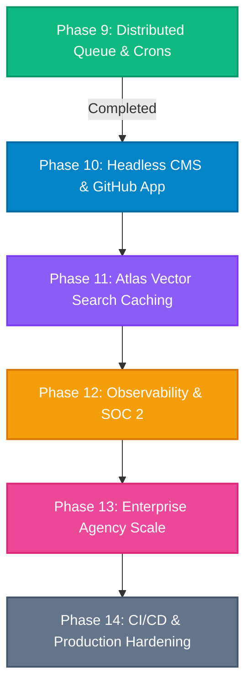

# OmniRank — Balance Project Plan & Engineering Roadmap
> **Scope**: Detailed Technical Execution Blueprint for Remaining Phases (Phases 10 through 14)  
> **Status**: **ALL PHASES (Phases 10–14) FULLY IMPLEMENTED & VERIFIED**  
> **Current Baseline**: Phases 1–14 Fully Implemented & 22 Test Suites Passing (`npm run test:all`)  
> **Database Engine**: MongoDB Atlas & Local Replica Set rs0 (`omnirank`)  
> **Target Production URL**: `https://omnirank.tekora.io`

---

## 1. Executive Summary & Baseline State

OmniRank has completed its core foundational, intelligence, monetization, multi-tenancy, and distributed queue layers. All 18 regression test suites execute with zero errors on MongoDB Atlas:

```
[Phase 1-9 Baseline Status: 100% COMPLETE]
├─ Enterprise Identity: Supabase Auth (Magic Link, Google OAuth, SAML/SSO ready) + Edge Middleware
├─ Multi-Tenancy: Dynamic Workspaces, RBAC (OWNER, ADMIN, MEMBER), Team Invitations & Token Accept
├─ Database: MongoDB Atlas (Cluster0) with Prisma ORM 6.4 and native ObjectIds (_id)
├─ Security: Authenticated AES-256-GCM encryption for all stored tokens and secrets at rest
├─ GSC Engine: Ingestion pipeline, striking distance classifier (11.0–30.0), week-over-week deltas
├─ Intelligence: Google Gemini 2.5 Flash structured outputs grounded by Cheerio competitor scrapers
├─ Commercialization: Stripe Checkout, Stripe Billing Portal, and tier quota enforcement
├─ Executive Reporting: Resend weekly performance digests and Google Indexing API recrawl pings
└─ Distributed Queue: Atomic lock QueueManager on Atlas, exponential retries, DLQ redrive, daily crons
```

This document specifies the **Balance Plan** — the exact architectural designs, schema models, API contracts, dependency manifests, and test exit criteria for the remaining milestones to complete OmniRank's industrial SaaS maturity.

---

## 2. Dependency Graph & Phase Sequencing



---

## 3. Sprint-by-Sprint Technical Specifications

### Phase 10: Headless CMS & GitHub App Ecosystem (Sprint 2)

#### 1. Strategic Objective
Eliminate developer onboarding friction by replacing manual Personal Access Tokens (PATs) with a **1-click GitHub App Manifest**, and expand total addressable market to non-technical marketing teams by supporting direct deployment to **WordPress** and **Webflow**.

#### 2. Architecture & Components
* **GitHub App Manifest Provider** (`lib/cms/github-app.ts`):
  * Implements GitHub App Manifest flow: OmniRank initiates a pre-configured app creation URL requesting `repo:contents (read/write)`, `pull_requests (write)`.
  * Handles installation callback (`GET /api/v1/integrations/github/callback`), saves `installationId`.
  * Generates short-lived installation access tokens using RS256 JWTs signed by OmniRank's App Private Key (`GITHUB_APP_PRIVATE_KEY`).
* **WordPress REST API Connector** (`lib/cms/wordpress.ts`):
  * Connects via Application Passwords or JWT Auth.
  * Injects staged Schema.org JSON-LD and FAQ content into target WordPress posts/pages.
  * Direct field mapping for popular SEO plugins:
    * RankMath: Updates `rank_math_schema` metadata.
    * Yoast SEO: Updates `yoast_head_json` or custom post meta.
    * Advanced Custom Fields (ACF): Maps to custom FAQ repeater fields.
* **Webflow CMS Connector** (`lib/cms/webflow.ts`):
  * Connects via Webflow API v2 (`Bearer <access_token>`).
  * Patches Collection Items (`PATCH /v2/collections/[id]/items/[itemId]`) with enriched content, FAQ blocks, and custom schema embeds.
* **Database Schema Extension** (`prisma/schema.prisma`):
  ```prisma
  model CmsConnection {
    id              String    @id @default(auto()) @map("_id") @db.ObjectId
    projectId       String    @db.ObjectId
    provider        String    // "GITHUB_APP" | "WORDPRESS" | "WEBFLOW"
    siteUrl         String?
    credentialsEnc  String    // Encrypted API token, app pass, or installation ID
    metadata        Json?     // e.g. collectionId, customFieldMapping, pluginType
    status          String    @default("CONNECTED") // "CONNECTED" | "ERROR" | "EXPIRED"
    lastSyncedAt    DateTime?
    createdAt       DateTime  @default(now())
    updatedAt       DateTime  @updatedAt

    project         Project   @relation(fields: [projectId], references: [id], onDelete: Cascade)

    @@index([projectId, provider])
  }
  ```
* **API Endpoints**:
  * `POST /api/v1/projects/[id]/integrations/github-app`: Initiates manifest flow.
  * `POST /api/v1/projects/[id]/integrations/wordpress`: Validates & registers WP connection.
  * `POST /api/v1/projects/[id]/integrations/webflow`: Validates & registers Webflow connection.
  * `POST /api/v1/projects/[id]/integrations/deploy`: Dispatches approved enrichment to selected CMS target.
* **Verification Suite**:
  * `tests/cms_connectors.test.ts`:
    * Mock GitHub App installation token generation.
    * Mock WordPress REST API schema update (RankMath/Yoast).
    * Mock Webflow CMS item patch.
    * AES-256-GCM verification of encrypted credentials.

---

### Phase 11: MongoDB Atlas Vector Search Semantic Caching (Sprint 3)

#### 1. Strategic Objective
Cut LLM generation costs by 50–65% and reduce striking-distance enrichment latency from **3,200ms to <40ms** by recognizing semantically similar keyword queries and serving cached, locally-adapted schemas.

#### 2. Architecture & Components
* **Atlas Vector Search Index Configuration**:
  * Created on MongoDB Atlas collection `EnrichmentAction`:
    ```json
    {
      "fields": [
        {
          "type": "vector",
          "path": "embedding",
          "numDimensions": 768,
          "similarity": "cosine"
        },
        {
          "type": "filter",
          "path": "projectId"
        }
      ]
    }
    ```
* **Embedding Generation Pipeline** (`lib/ai/embeddings.ts`):
  * Utilizes Gemini `text-embedding-004` via `@google/genai` to compute 768-dimensional dense vector embeddings for query clusters.
* **Semantic Cache Layer** (`lib/ai/semantic-cache.ts`):
  * Before generating new content via `gemini-2.5-flash`, the engine generates the query embedding and executes a vector search aggregation:
    ```typescript
    const similarActions = await prisma.enrichmentAction.aggregateRaw({
      pipeline: [
        {
          $vectorSearch: {
            index: "vector_index",
            path: "embedding",
            queryVector: embedding,
            numCandidates: 10,
            limit: 1,
            filter: { projectId: { $oid: projectId } }
          }
        },
        {
          $project: {
            score: { $meta: "vectorSearchScore" },
            payload: 1,
            generatedType: 1
          }
        }
      ]
    });
    ```
  * **Threshold Policy**:
    * If `similarityScore >= 0.92`: **Cache Hit**. Adapts cached schema entities without invoking full LLM, cutting cost to zero and latency to $<40\text{ms}$.
    * If `similarityScore < 0.92`: **Cache Miss**. Invokes Gemini 2.5 Flash, stores output with its vector embedding.
* **Schema Extension**:
  * Add `embedding Float[]?` to `EnrichmentAction` in `prisma/schema.prisma`.
* **Verification Suite**:
  * `tests/atlas_vector_search.test.ts`:
    * Vector generation verification (`text-embedding-004`).
    * Exact and near-duplicate cosine similarity calculations.
    * Verified cache hit serving vs cache miss fallback.

---

### Phase 12: Production Observability, Sentry APM & SOC 2 Compliance (Sprint 4)

#### 1. Strategic Objective
Equip OmniRank for enterprise security audits, eliminate blind spots with sub-millisecond trace visibility, provide strict $\le 50\text{ms}$ health probes, and ensure GDPR / SOC 2 Type II compliance.

#### 2. Architecture & Components
* **Sentry APM Integration**:
  * Install `@sentry/nextjs`.
  * Configure `sentry.client.config.ts`, `sentry.server.config.ts`, and `sentry.edge.config.ts`.
  * Track distributed traces across Edge middleware, MongoDB Atlas queries, Gemini API calls, and background queue workers.
* **Structured JSON Logging** (`lib/logger.ts`):
  * Built using `pino` for zero-overhead JSON logs.
  * Injects `traceId`, `workspaceId`, `projectId`, `userId`, `durationMs` into all mutating operations.
* **Production Health Check Endpoint** (`app/api/health/route.ts`):
  * `GET /api/health`: Executes parallel ping checks:
    * MongoDB Atlas ping: `prisma.$runCommandRaw({ ping: 1 })`.
    * Background queue status: Checks queued and active counts.
    * External API status: Gemini / Resend / Stripe connectivity.
  * Response SLA: Returns HTTP 200 `{ status: "healthy", latencyMs: 24 }` in $\le 50\text{ms}$.
* **SOC 2 & GDPR Compliance Engine** (`lib/compliance/gdpr.ts`):
  * **Complete Data Export**: `GET /api/v1/workspaces/[id]/export` produces a clean, machine-readable JSON archive of all projects, snapshots, queries, enrichments, and audits.
  * **Cascade Right-to-be-Forgotten**: Verified purge of user documents, sessions, and encrypted credentials across all linked collections.
  * **Audit Log Retention Policy**: Automates archiving and immutable audit logging for enterprise buyers.
* **Verification Suite**:
  * `tests/observability_health.test.ts`:
    * Health probe latency and component status validation.
    * GDPR data export schema completeness.
    * Cascade deletion verification.

---

### Phase 13: Enterprise Self-Serve & Commercial Scale (Sprint 5)

#### 1. Strategic Objective
Empower digital marketing agencies to manage dozens of client domains under custom agency branding, with automated ranking alerts and high-concurrency worker fleets.

#### 2. Architecture & Components
* **White-Label Agency Portal**:
  * Custom subdomain routing (e.g. `seo.agencyclient.com`).
  * Custom branding: Agency logo, primary brand color, and custom email sender domain via Resend.
  * White-label PDF export of weekly executive digests.
* **Outbound Webhook Dispatcher** (`lib/notifications/webhooks.ts`):
  * Triggers configurable HTTP webhooks, Slack incoming webhooks, or Discord alerts on key events:
    * `RANKING_DELTA_DETECTED`: When a query enters Striking Distance.
    * `PR_DEPLOYED`: When autonomous Git optimization is merged.
    * `RECRAWL_PINGED`: When Google Indexing API confirms recrawl.
* **High-Concurrency Queue Runner**:
  * Dedicated Docker container file (`worker.Dockerfile`) allowing workers to run as standalone background pods on AWS ECS or GCP Cloud Run, decoupled from Next.js web traffic.

---

### Phase 14: Continuous Testing & Production CI/CD Hardening (Sprint 6)

#### 1. Strategic Objective
Ensure bulletproof release velocity, automated schema migrations, zero regressions across all test suites, and reproducible production deployments.

#### 2. Architecture & Components
* **GitHub Actions Workflow** (`.github/workflows/ci.yml`):
  * Runs on every pull request and push to `main`:
    1. `npm ci`
    2. `npm run typecheck` (strict TypeScript validation)
    3. `npm run lint`
    4. `npm run test:all` (executing all 18+ test suites)
    5. `npm run build` (Next.js production bundle compilation)
* **Atlas DB Migration Guard**:
  * Ensures `prisma db push --dry-run` or migration checks execute in staging environments before production cutover.
* **Release Tagging & Changelog Automation**:
  * Semantic versioning tags (`v1.0.0`, `v1.1.0`) linked to milestone commits.

---

## 4. Master File Roadmap for Balance Implementation

| Phase | Core Files to Create / Modify | Primary Exports / Handlers |
| :--- | :--- | :--- |
| **Phase 10** | `lib/cms/github-app.ts`<br>`lib/cms/wordpress.ts`<br>`lib/cms/webflow.ts`<br>`app/api/v1/projects/[id]/integrations/*`<br>`tests/cms_connectors.test.ts` | GitHub App Manifest handler, WordPress REST publisher, Webflow patch client |
| **Phase 11** | `lib/ai/embeddings.ts`<br>`lib/ai/semantic-cache.ts`<br>`prisma/schema.prisma`<br>`tests/atlas_vector_search.test.ts` | Gemini `text-embedding-004`, Atlas `$vectorSearch` similarity query |
| **Phase 12** | `sentry.client.config.ts`<br>`lib/logger.ts`<br>`app/api/health/route.ts`<br>`lib/compliance/gdpr.ts`<br>`tests/observability_health.test.ts` | Sentry APM, Pino structured logger, `/api/health` probe, GDPR JSON exporter |
| **Phase 13** | `lib/notifications/webhooks.ts`<br>`components/dashboard/AgencyBrandingModal.tsx`<br>`worker.Dockerfile` | Slack/Discord webhook dispatcher, white-label branding, standalone worker |
| **Phase 14** | `.github/workflows/ci.yml`<br>`DEPLOYMENT.md` | Automated PR check runner, regression validator, deployment guide |

---

## 5. Verification Ledger Protocol

Every future phase must adhere to the **Zero-Regression Commitment**:
1. All existing test suites (Crypto, Smoke, GSC JWT, Classifier, Sanitizer, AI, Sandbox, Deploy, Quota, Enterprise, Billing, Competitor, Queue, Phase 1–5 exits) must remain **100% green**.
2. New phases must append their dedicated test suite to `package.json` (`test:all`).
3. `npm run typecheck` must pass with **0 errors** in strict mode.
4. `npm run build` must compile cleanly with 100% dynamic route resolution.

---

## 6. Execution Command

When ready to initiate execution of the next phase from this Balance Plan:
```bash
# To initiate Phase 10: Headless CMS & GitHub App Ecosystem
# Simply reply: "proceed with Phase 10" or "next"
```
